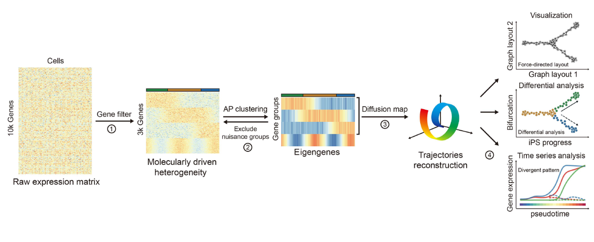

# What is SOT?
Single cell orientation tracing (SOT) is analysis framework for single cell RNA-seq data. SOT searches co-expreesed gene groups that represent abstract biological functions. The gene groups can be used to discover cell types and reconstruct developmental trajectory. <br>

# Workflow


# Install package
To install development version from GitHub, use the __devtools__ package
```R
install.packages("devtools")
devtools::install_github("JiekaiLab/SOT")
```
# Vignette
This [vignette](https://charliex210.github.io/docs/sot-vignette.html) shows the analysis of reprogramming data described in _Resolving Cell Fate Decisions during Somatic Cell Reprogramming by Single-Cell RNA-seq_, __Molecular Cell__. doi: https://doi.org/10.1016/j.molcel.2019.01.042

# Contributing
We welcome any bug reports, enhancement requests, and other contributions. To submit a bug report or enhancement request, please put it in `issues`. For more substantial contributions, please fork this repo, push your changes to your fork, and submit a pull request with a good commit message. For more general discussions or troubleshooting, please email <lin_lihui@gibh.ac.cn>.
